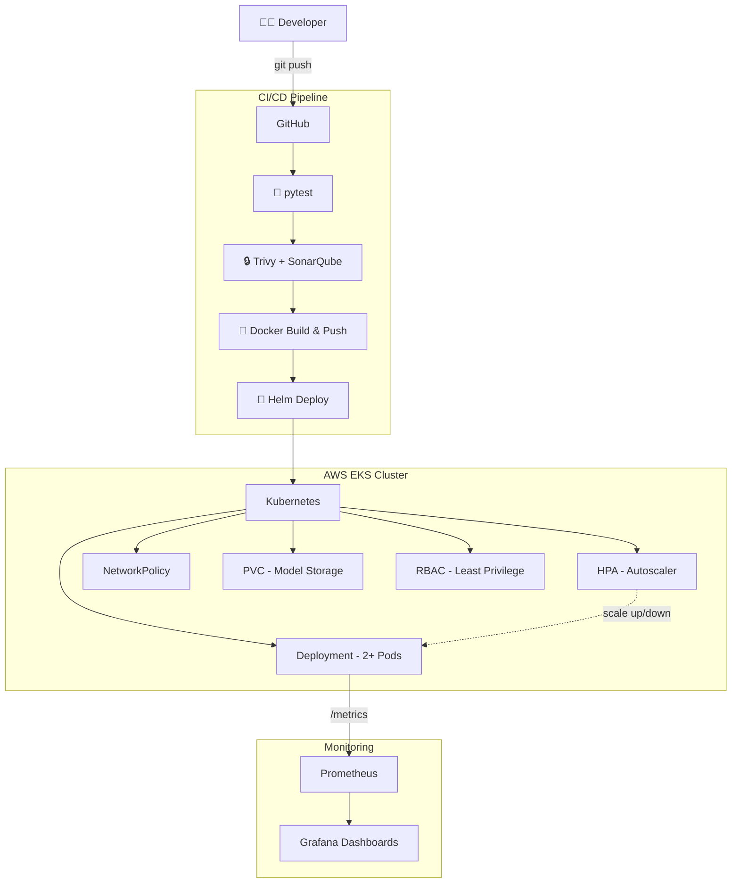
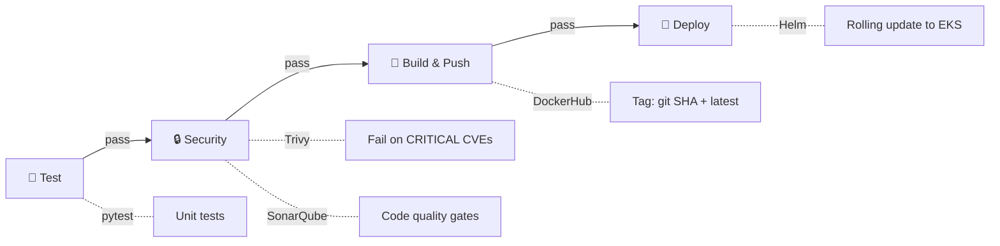

# ☁️ Cloud-Native ML Inference Platform

> **Production-grade machine learning model serving on Kubernetes with end-to-end DevSecOps automation.**

This project demonstrates how to take an ML model from training to production using industry-standard cloud-native tools — automated CI/CD, container security scanning, infrastructure-as-code, autoscaling, and full observability.

---

## 🎯 What This Project Does

| What | How |
|------|-----|
| **Serves ML predictions** via REST API | FastAPI + scikit-learn (Iris classifier) |
| **Packages** the app as a secure container | Multi-stage Docker build, non-root user |
| **Deploys** to Kubernetes automatically | Helm chart with rolling updates |
| **Provisions** cloud infrastructure reproducibly | Terraform → AWS EKS |
| **Scans** for vulnerabilities on every push | Trivy (blocks on CRITICAL CVEs) |
| **Analyzes** code quality continuously | SonarQube integration |
| **Autoscales** based on traffic | Kubernetes HPA (CPU + Memory) |
| **Monitors** everything in real-time | Prometheus + Grafana dashboards |

---

## 🏗️ Architecture Overview



### CI/CD Pipeline Flow



### How It All Connects

1. **Developer pushes code** → GitHub triggers the CI/CD pipeline
2. **Pipeline runs 4 jobs in sequence:**
   - `test` — Unit tests with pytest
   - `security` — Trivy scans the Docker image; **pipeline fails if CRITICAL vulnerabilities are found**. SonarQube checks code quality
   - `build-push` — Builds the Docker image and pushes to DockerHub (tagged with Git SHA)
   - `deploy` — Helm installs/upgrades the app on the EKS cluster
3. **Kubernetes handles the rest** — HPA scales pods based on load, Prometheus scrapes metrics, Grafana visualizes them

---

## 🛠️ Tech Stack

| Category | Tool | Purpose |
|----------|------|---------|
| **Application** | FastAPI + scikit-learn | REST API serving ML predictions |
| **Containerization** | Docker (multi-stage) | Lightweight, secure container images |
| **Orchestration** | Kubernetes (AWS EKS) | Container orchestration and scaling |
| **Package Management** | Helm | Templated Kubernetes deployments |
| **Infrastructure** | Terraform | Reproducible cloud infrastructure |
| **CI/CD** | GitHub Actions | Automated test, scan, build, deploy |
| **Security Scanning** | Trivy | Container vulnerability detection |
| **Code Quality** | SonarQube | Static analysis and code smells |
| **Monitoring** | Prometheus + Grafana | Metrics collection and dashboards |
| **Autoscaling** | HPA | Scale pods on CPU/memory utilization |

---

## 📁 Project Structure

```
mlops-project/
│
├── app/                          ← ML Application (FastAPI)
│   ├── main.py                      API server: /predict, /health, /ready, /metrics
│   ├── model.py                     Model loading & inference logic
│   ├── train.py                     Training script (Iris RandomForest)
│   └── requirements.txt            Pinned Python dependencies
│
├── tests/
│   └── test_app.py               ← Unit tests (pytest) — 10 test cases
│
├── Dockerfile                    ← Multi-stage build (train → serve)
│
├── helm/ml-platform/             ← Helm Chart
│   ├── Chart.yaml                   Chart metadata
│   ├── values.yaml                  All configurable values
│   └── templates/
│       ├── deployment.yaml          Pod spec with probes, security, resources
│       ├── service.yaml             ClusterIP service
│       ├── hpa.yaml                 Autoscaler (2–10 pods)
│       ├── pvc.yaml                 Persistent storage for model files
│       ├── serviceaccount.yaml      Dedicated service account
│       ├── rbac.yaml                Least-privilege Role + RoleBinding
│       └── networkpolicy.yaml       Restrict ingress to app port only
│
├── terraform/                    ← Infrastructure as Code
│   ├── main.tf                      VPC + EKS Cluster + Node Groups
│   ├── variables.tf                 Configurable inputs
│   ├── outputs.tf                   Cluster endpoint, kubectl command
│   ├── providers.tf                 AWS + K8s + Helm providers
│   └── backend.tf                   S3 remote state (ready to enable)
│
├── .github/workflows/
│   └── ci-cd.yaml                ← CI/CD Pipeline (4 jobs)
│
├── monitoring/                   ← Observability
│   ├── prometheus-values.yaml       kube-prometheus-stack Helm config
│   ├── grafana-dashboards/
│   │   └── ml-platform-dashboard.json   Custom dashboard (8 panels)
│   └── README.md                    Setup instructions
│
├── sonar-project.properties      ← SonarQube configuration
└── .trivyignore                  ← Trivy CVE exceptions
```

---

## 🔒 Security Practices

| Layer | What's Implemented |
|-------|--------------------|
| **Container** | Non-root user, read-only filesystem, all Linux capabilities dropped |
| **Docker Image** | Multi-stage build — no build tools or cache in production image |
| **Kubernetes** | Dedicated ServiceAccount with `automountServiceAccountToken: false` |
| **RBAC** | Namespace-scoped Role — pods can only read ConfigMaps and Secrets |
| **Network** | NetworkPolicy blocks all traffic except the application port |
| **CI/CD** | Trivy **fails the pipeline** on CRITICAL vulnerabilities |
| **Code** | SonarQube runs on every push for quality gates |

---

## 📊 Monitoring Dashboard

The Grafana dashboard includes 8 panels tracking:

| Panel | What It Shows |
|-------|---------------|
| Request Rate | Requests per second over time |
| Response Latency | p50, p95, p99 percentile latencies |
| Error Rate | Percentage of 5xx responses |
| Active Pods | Current running pod count |
| CPU Usage | Average CPU utilization (gauge) |
| Memory Usage | Average memory utilization (gauge) |
| Predictions by Class | Distribution of model predictions (pie) |
| Inference Time | Latency distribution histogram |

---

## 🚀 How to Run

### Local Development

```bash
# Install dependencies & train model
pip install -r app/requirements.txt
python -m app.train

# Start the API server
MODEL_PATH=./models/model.joblib uvicorn app.main:app --reload --port 8000

# Test a prediction
curl -X POST http://localhost:8000/predict \
  -H "Content-Type: application/json" \
  -d '{"features": [5.1, 3.5, 1.4, 0.2]}'
```

### Docker

```bash
docker build -t ml-platform:latest .
docker run -p 8000:8000 ml-platform:latest
```

### Deploy to Kubernetes

```bash
# 1. Provision infrastructure
cd terraform && terraform init && terraform apply

# 2. Deploy application
helm upgrade --install ml-platform helm/ml-platform/ \
  --namespace ml-platform --create-namespace

# 3. Install monitoring
helm install monitoring prometheus-community/kube-prometheus-stack \
  -n monitoring --create-namespace -f monitoring/prometheus-values.yaml
```

---

## 🔑 Required GitHub Secrets

| Secret | Purpose |
|--------|---------|
| `DOCKER_HUB_USERNAME` | DockerHub login |
| `DOCKER_HUB_ACCESS_TOKEN` | DockerHub push access |
| `AWS_ACCESS_KEY_ID` | Terraform & EKS access |
| `AWS_SECRET_ACCESS_KEY` | Terraform & EKS access |
| `AWS_REGION` | Target AWS region |
| `EKS_CLUSTER_NAME` | Cluster to deploy to |
| `SONAR_TOKEN` | SonarQube authentication |
| `SONAR_HOST_URL` | SonarQube server URL |

---

## 🧹 Teardown

```bash
helm uninstall ml-platform -n ml-platform
helm uninstall monitoring -n monitoring
cd terraform && terraform destroy
```
